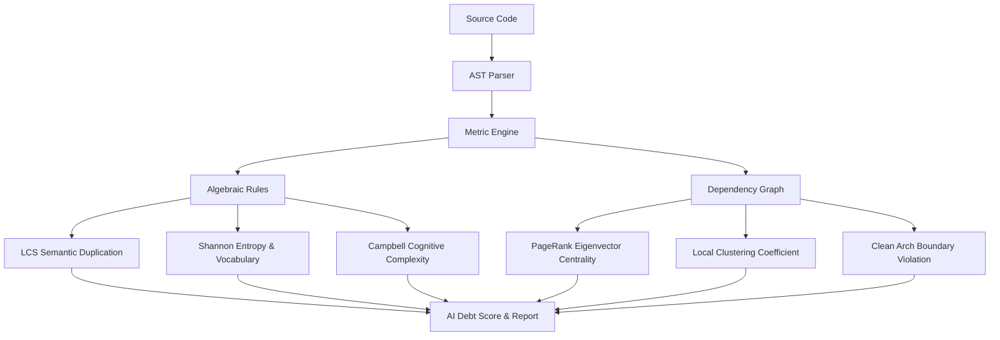

# Vetro — AI Code Debt Scanner

> **Math proves. AI opines.**

## The Problem: The AI Code Tsunami & Structural Code Decay

The software industry is experiencing an unprecedented surge in development speed. Large Language Models (LLMs) and AI coding agents can generate thousands of lines of code in seconds. However, this speed comes at a hidden, compounding cost: **AI-Induced Technical Debt**.

Because LLMs generate code sequentially (token-by-token) and session-by-session, they lack a unified, global mental model of the codebase. When prompted to add features or fix bugs, they default to the path of least resistance:
* **Semantic Duplication:** Re-implementing the same logic with minor naming variations because they cannot "remember" or "see" existing helpers.
* **Speculative Generality & Over-Abstraction:** Creating abstract classes, interfaces, and layers of indirection "just in case" because it mimics their training data, adding zero architectural value.
* **Branching Bloat:** Appending nested `if` statements and conditions to handle edge cases safely, rather than refactoring or utilizing polymorphism, causing cyclomatic and cognitive complexity to skyrocket.
* **Chaotic Coupling:** Importing modules indiscriminately to make a patch work, creating cyclic dependencies and architectural violations.

The result is **code decay** at a rate never seen before. Standard linters (which check for formatting and syntax) and compiler tools are blind to these structural and semantic patterns.

---

## The Objective: A Deterministic Rail for AI Code

Vetro was built to act as a **deterministic, mathematical rail** that keeps AI agents and developers from derailing into technical debt. 

Our core philosophy is simple: **Vetro does NOT use AI to analyze code.** Using LLMs to audit LLM-generated code leads to hallucinations, non-deterministic results, and high token costs. Instead, Vetro uses **pure mathematics and graph theory** on Abstract Syntax Trees (AST) to provide reproducible, medible, and objective code-debt analysis.

Vetro's primary goals are:
1. **To act as an impartial quality gate** for teams and clients integrating AI into their workflows.
2. **To calculate a single, actionable metric**—the **AI Debt Score**—alongside concrete structural findings.
3. **To ensure that AI-driven speed does not destroy software maintainability.**

<p align="center">
  <b><font size="5" color="#EA4335">AI OPINES.</font> <font size="5" color="#4285F4">MATHEMATICS DETERMINES.</font></b>
</p>

---

## How It Works

Vetro analyzes your codebase by running a multi-layered compiler and mathematical pipeline:



1. **AST Representation:** Native compiler APIs parse source code into Abstract Syntax Trees (ASTs), isolating declarations, expressions, and structures.
2. **Algebraic Similarity & LCS Pruning:** Identifiers and literals are normalized (stripped) to compare structural tokens. A fast $O(1)$ AST structural hash check (FNV-1a) is performed, followed by a mathematical LCS length-ratio pruning filter, before running costly Longest Common Subsequence (LCS) comparisons to detect deep semantic clones.
3. **Information Theory (Shannon Entropy):** Measures the information density of AST node distributions and identifier vocabularies to flag highly repetitive, flat boilerplate or copy-paste structures.
4. **Graph Topology:** Builds a directed graph of module imports to compute PageRank-style Eigenvector Centrality (bottlenecks), Local Clustering Coefficients (modularity bridges), and DFS-based Circular Dependencies.
5. **Clean Architecture Auditing:** Enforces dependency direction constraints (e.g., Domain <- Application <- Infrastructure <- Presentation) at the AST level, blocking boundary violations.

## What Makes Vetro Different

| Traditional Linters | Vetro |
|---|---|
| Text-based duplication | **Semantic duplication** (AST structural similarity) |
| Generic complexity warnings | **AI-specific patterns** (copy-mutate, orphaned abstractions) |
| Style enforcement | **Intent gap detection** (complex code without WHY) |
| Pass/fail per rule | **AI Debt Score** (single actionable metric) |

## Quick Start

```bash
# Install
dart pub global activate vetro

# Analyze your project
vetro analyze ./lib

# Generate config file
vetro init
```

## What It Detects

| Rule | What | Math |
|---|---|---|
| 🧟 Semantic Duplication | Functions that do the same thing with different names | AST cosine similarity ≥ 80% |
| 🔄 Copy-Mutate | Near-identical code blocks with minor variations | Token similarity ≥ 70% |
| 🏚️ Orphaned Abstractions | Interfaces with only 1 implementation | Inheritance graph analysis |
| 🫥 Intent Gaps | Complex functions with zero WHY comments | Entropy × complexity ratio |
| 🌀 Cyclomatic Complexity | Over-nested functions | CC = E - N + 2P ≥ 15 |
| ⚠️ Fragile Tests | Tests coupled to implementation | Mock count > 3 per test |
| 🧠 Halstead Complexity | Functions requiring high cognitive effort | Halstead effort ≥ 50,000 |
| 🧠 Cognitive Complexity | Functions hard to understand (Campbell's metric) | Branching/nesting level analysis ≥ 15 |
| 📉 Shannon Entropy | Flat, highly repetitive boilerplate or structures | AST node type entropy < 1.8 |
| 🕸️ Eigenvector Centrality | Global import bottlenecks in dependency graph | PageRank centrality score ≥ 0.40 |
| 🧲 Local Clustering | Chaotic import bridge files in the import graph | Local Clustering Coefficient < 0.15 |
| 🧲 Low Cohesion | Classes violating Single Responsibility Principle | Pairwise method identifier similarity < 15% |
| 🔗 Circular Dependency | Import dependency cycles between files | DFS cycle detection |
| 🕸️ Tight Coupling | Highly interconnected files | (fanIn + fanOut) / totalNodes ≥ 25% |
| 🛡️ Boundary Violation | Clean Architecture layering rules violations | Layer flow analysis |

## Configuration

Create a `vetro.yaml` in your project root:

```yaml
vetro:
  version: 1
  include:
    - lib/**/*.dart
  exclude:
    - "**/*.g.dart"
    - "**/*.freezed.dart"
  rules:
    semantic_duplication:
      enabled: true
      threshold: 0.80
      severity: warning
    cyclomatic_complexity:
      threshold: 15
      severity: warning
```

## Output Formats

```bash
vetro analyze ./lib                    # Terminal (default)
vetro analyze ./lib --format json      # JSON (for CI/CD)
vetro analyze ./lib --format markdown  # Markdown (for PRs)
```

## Real-World Audits & Benchmarks

Vetro has been heavily tested and verified against real-world projects and production pull requests to validate its metrics:

* **[Project Analysis Report](docs/projects_analysis_report.md):** Detailed analysis of code-debt findings across various real-world production projects (anonymized as `Proyecto_XXX_A`, `Proyecto_XXX_B`, etc.).
* **[Performance Benchmark Report](docs/performance_benchmark_report.md):** Execution speed benchmarks on medium-to-large codebases pre- and post-algorithmic optimizations.
* **[Token Savings & Cost Report](docs/token_savings_and_cost_report.md):** Comparative analysis of execution costs and time between Vetro and equivalent LLM-based code audits.
* **[Pull Request Audits](docs/walkthrough.md#cupertino_http-manual--pr-audits-verification):** Real-world case studies analyzing production PRs from Google and RxDart repositories (such as [Google PR Audit](docs/google_pr_audit_report.md), [RxDart PR Audit](docs/rxdart_pr_audit_report.md), and [GitHub Experiments](docs/github_experiments_report.md)).

## Philosophy

Vetro does NOT use AI to analyze code. Every finding is backed by deterministic mathematics:

- **Cosine similarity** on normalized AST token vectors
- **Shannon entropy** for information density
- **Cyclomatic complexity** via control flow graph analysis
- **Graph theory** for dependency and inheritance analysis

Same input → same output. Always. No opinions. No hallucinations.

## FAQ (Frequently Asked Questions)

### How do I know what the AI is actually writing?
Standard source code is just text, which can easily hide bad practices under cosmetic renaming or clean-looking layouts. Vetro bypasses the superficial text by parsing code into Abstract Syntax Trees (ASTs). We don't look at the variable names; we look at the structural skeleton of the logic. By evaluating token bag distributions and control flow paths, we expose the underlying structural patterns of the generated code.

### How do I know where the boundary or "limit" is?
The boundaries are not arbitrary. They are defined by the physical limits of human cognitive ergonomics and modular system design. A developer's working memory can only handle $7 \pm 2$ items at once; hence, when Cognitive Complexity exceeds 15, the code crosses a physical usability limit. When the Local Clustering Coefficient drops below 15%, the import graph becomes mathematically chaotic. Vetro's limits are computer science boundaries, not subjective opinions.

### How do I know if my audit tool is telling the truth or lying to me?
**Mathematics does not lie, and it cannot hallucinate.** Because Vetro does not use LLMs, neural networks, or probabilistic models for analysis, it is 100% deterministic. If Vetro reports an 85% semantic similarity, it is because the cosine of the angle between the token vectors is exactly 0.85. If it flags a circular dependency, it is because a physical path ($A \rightarrow B \rightarrow C \rightarrow A$) exists in the graph. The tool is fully auditable, testable, and reproducible. Same input always yields the same output.

### Isn't measuring Vetro on Vetro a paradox?
It is a classic software engineering practice known as *self-hosting* or *dogfooding*. It is not a paradox, but the ultimate test of consistency. If Vetro enforces rules of modularity and clean design, its own source code must obey the same physical laws of software architecture it imposes. Passing its own checks with a 100/100 score mathematically proves its own structural hygiene.

### Does Vetro force developers into over-engineering and over-abstraction?
Absolutely not. Vetro does not aim to be a merciless executioner or an enforcer of excessive abstraction. Over-engineering is just as destructive as spaghetti code; breaking simple scripts into dozens of tiny files and speculative interfaces generates its own heavy indirection debt. Vetro is designed to prevent both extremes. For instance, the **Orphaned Abstractions** rule actively flags interfaces with only a single implementation, discouraging "just-in-case" speculative engineering. Vetro acts as a guiding rail to keep code simple, modular, and pragmatic—not over-designed.

## License

MIT
