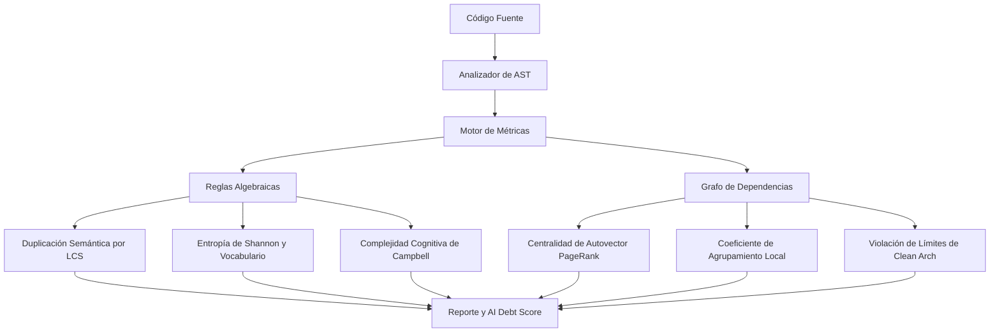

# Vetro — Analizador de Deuda Técnica Inducida por IA

> **La IA opina. La matemática demuestra.**

## El Problema: El Tsunami de Código de IA y la Degeneración Estructural

La industria del software está experimentando una aceleración sin precedentes en la velocidad de desarrollo. Los Modelos de Lenguaje Grande (LLMs) y los agentes de IA pueden generar miles de líneas de código en segundos. Sin embargo, esta velocidad conlleva un costo oculto y acumulativo: **la Deuda Técnica Inducida por IA**.

Debido a que las IAs generan código de forma secuencial (token a token) y sesión por sesión, carecen de un modelo mental arquitectónico global de la base de código. Al agregar características o solucionar bugs, suelen optar por el camino de menor resistencia:
* **Duplicación Semántica:** Volver a implementar la misma lógica con variaciones estéticas de nomenclatura porque no pueden "recordar" o "ver" los helpers existentes.
* **Generalidad Especulativa y Sobre-Abstracción:** Crear clases abstractas, interfaces y capas de indirección "por si acaso" porque imita sus datos de entrenamiento, sin añadir valor real.
* **Complejidad de Bifurcación:** Añadir condicionales `if` anidados para manejar casos extremos de forma segura, en lugar de refactorizar o usar polimorfismo, disparando la complejidad ciclomática y cognitiva.
* **Acoplamiento Caótico:** Importar módulos indiscriminadamente para hacer funcionar un parche local, creando dependencias cíclicas y violaciones arquitectónicas.

El resultado es una **degradación de código** a un ritmo nunca antes visto. Los linters tradicionales (que validan formato y estilo) y los compiladores son ciegos ante estos patrones estructurales y semánticos.

---

## El Objetivo: Un Riel Determinista para el Código de IA

Vetro fue diseñado para actuar como un **riel guía matemático y determinista** que evita que los agentes de IA y los desarrolladores desvíen el proyecto hacia la deuda técnica.

Nuestra filosofía central es simple: **Vetro NO utiliza IA para analizar código.** Usar LLMs para auditar código generado por LLMs introduce alucinaciones, resultados no deterministas y altos costos de tokens. En su lugar, Vetro utiliza **matemática pura y teoría de grafos** sobre Árboles de Sintaxis Abstracta (AST) para proveer un análisis de deuda técnico reproducible, medible y objetivo.

Los objetivos principales de Vetro son:
1. **Actuar como una puerta de calidad imparcial** para equipos y clientes que integran IA en sus flujos de trabajo.
2. **Calcular una única métrica accionable**—el **AI Debt Score** (Puntaje de Deuda de IA)—junto con hallazgos estructurales concretos.
3. **Asegurar que la velocidad impulsada por la IA no destruya la mantenibilidad del software.**

<p align="center">
  <b><font size="5" color="#EA4335">LA IA OPINA.</font> <font size="5" color="#4285F4">LA MATEMÁTICA DETERMINA.</font></b>
</p>

---

## Cómo Funciona

Vetro analiza tu base de código mediante un pipeline matemático y compilador de múltiples capas:



1. **Representación de AST:** Las APIs nativas del compilador parsean el código fuente en Árboles de Sintaxis Abstracta (AST), aislando declaraciones, expresiones y estructuras.
2. **Similitud Algebraica y Poda de LCS:** Se normalizan los identificadores y literales para comparar tokens estructurales. Se ejecuta una comprobación rápida de hash estructural AST en $O(1)$ (FNV-1a), seguida de un filtro de poda de longitud basado en la relación matemática del LCS, antes de calcular el costo del Algoritmo del Subsecuencia Común Más Larga (LCS) para detectar clones semánticos profundos.
3. **Teoría de la Información (Entropía de Shannon):** Mide la densidad de información en las distribuciones de nodos AST y vocabulario de identificadores para alertar sobre estructuras o código repetitivo y plano de IA.
4. **Topología de Grafos:** Construye un grafo dirigido de importaciones de módulos para calcular la centralidad de autovector estilo PageRank (cuellos de botella), coeficientes de agrupamiento local (puentes de modularidad) y ciclos de dependencia (DFS).
5. **Auditoría de Arquitectura Limpia (Clean Architecture):** Aplica restricciones de dirección de dependencias (por ejemplo: Domain <- Application <- Infrastructure <- Presentation) a nivel de AST, bloqueando violaciones de límites de capas.

## ¿Qué Hace Diferente a Vetro?

| Linters Tradicionales | Vetro |
|---|---|
| Duplicación basada en texto plano | **Duplicación semántica** (similitud estructural de AST) |
| Alertas genéricas de complejidad | **Patrones específicos de IA** (copy-mutate, abstracciones huérfanas) |
| Cumplimiento de estilo de código | **Detección de vacíos de intención** (código complejo sin explicaciones de *por qué*) |
| Aprobado/Fallo por regla | **AI Debt Score** (una única métrica accionable y compuesta) |

## Inicio Rápido

```bash
# Instalar
dart pub global activate vetro

# Analizar tu proyecto
vetro analyze ./lib

# Generar archivo de configuración
vetro init
```

## ¿Qué Detecta Vetro?

| Regla | Qué Hace | Matemática / Criterio |
|---|---|---|
| 🧟 Semantic Duplication | Funciones que hacen lo mismo con diferentes nombres | Similitud de coseno en AST ≥ 80% |
| 🔄 Copy-Mutate | Bloques de código casi idénticos con variaciones menores | Similitud de tokens ≥ 70% |
| 🏚️ Orphaned Abstractions | Interfaces con solo una implementación real | Análisis del grafo de herencia |
| 🫥 Intent Gaps | Funciones complejas sin comentarios que expliquen el *por qué* | Ratio de entropía de comentarios × complejidad |
| 🌀 Cyclomatic Complexity | Funciones excesivamente anidadas | CC = E - N + 2P ≥ 15 |
| ⚠️ Fragile Tests | Pruebas unitarias demasiado acopladas a la implementación | Cuenta de mocks > 3 por prueba |
| 🧠 Halstead Complexity | Funciones que requieren un alto esfuerzo cognitivo | Esfuerzo de Halstead ≥ 50,000 |
| 🧠 Cognitive Complexity | Funciones difíciles de entender (métrica de Campbell) | Análisis del nivel de anidamiento/bifurcación ≥ 15 |
| 📉 Shannon Entropy | Boilerplate de IA plano o estructuras muy repetitivas | Entropía del tipo de nodo AST < 1.8 |
| 🕸️ Eigenvector Centrality | Embotellamientos de importación global en el grafo de dependencias | Puntaje de centralidad de PageRank ≥ 0.40 |
| 🧲 Local Clustering | Archivos puente caóticos en el grafo de importación | Coeficiente de agrupamiento local < 0.15 |
| 🧲 Low Cohesion | Clases que violan el Principio de Responsabilidad Única | Similitud de coseno por pares de identificadores de métodos < 15% |
| 🔗 Circular Dependency | Ciclos de dependencias de importación entre archivos | Detección de ciclos por DFS |
| 🕸️ Tight Coupling | Archivos altamente interconectados | (fanIn + fanOut) / totalNodes ≥ 25% |
| 🛡️ Boundary Violation | Violaciones de reglas de capas de Clean Architecture | Análisis de flujo de dependencias entre capas |

## Configuración

Crea un archivo `vetro.yaml` en la raíz de tu proyecto:

```yaml
vetro:
  version: 1
  include:
    - lib/**/*.dart
  exclude:
    - "**/*.g.dart"
    - "**/*.freezed.dart"
  rules:
    semantic_duplication:
      enabled: true
      threshold: 0.80
      severity: warning
    cyclomatic_complexity:
      threshold: 15
      severity: warning
```

## Formatos de Salida

```bash
vetro analyze ./lib                    # Terminal (por defecto, con colores ANSI)
vetro analyze ./lib --format json      # JSON (para pipelines de CI/CD)
vetro analyze ./lib --format markdown  # Markdown (para comentarios de Pull Requests)
```

## Auditorías y Benchmarks en el Mundo Real

Vetro ha sido probado y verificado exhaustivamente contra proyectos reales y pull requests de producción para validar sus métricas:

* **[Reporte de Análisis de Proyectos](docs/projects_analysis_report.md):** Análisis detallado de los hallazgos de deuda técnica en varios proyectos de producción reales (anonimizados como `Proyecto_XXX_A`, `Proyecto_XXX_B`, etc.).
* **[Reporte de Rendimiento (Benchmark)](docs/performance_benchmark_report.md):** Tiempos de ejecución y velocidad del analizador en bases de código medianas y grandes, antes y después de nuestras optimizaciones algorítmicas.
* **[Reporte de Ahorro de Tokens y Costos](docs/token_savings_and_cost_report.md):** Comparativa del costo financiero y de tiempo entre Vetro y auditorías equivalentes basadas en LLM.
* **[Auditorías de Pull Requests](docs/walkthrough.md#cupertino_http-manual--pr-audits-verification):** Casos de estudio en el mundo real analizando PRs de producción de repositorios de Google y RxDart (incluyendo la [Auditoría de PR de Google](docs/google_pr_audit_report.md), la [Auditoría de PR de RxDart](docs/rxdart_pr_audit_report.md), y el [Reporte de Experimentos de GitHub](docs/github_experiments_report.md)).
* **[Hoja de Ruta de Validación Científica](docs/scientific_validation_roadmap.md):** Metodología de investigación, pruebas de invariantes algebraicos basadas en propiedades y planificación de fases científicas para la verificación de Vetro.

## Filosofía

Vetro NO utiliza IA para analizar código. Cada hallazgo está respaldado por matemática determinista:

* **Similitud de coseno** sobre vectores de tokens de AST normalizados.
* **Entropía de Shannon** para evaluar la densidad de información.
* **Complejidad ciclomática y cognitiva** mediante análisis de control de flujo.
* **Teoría de grafos** para el análisis de dependencias e herencia.

Mismo input -> mismo output. Siempre. Sin opiniones subjetivas. Sin alucinaciones.

## Preguntas Frecuentes (FAQ)

### ¿Cómo sé lo que la IA realmente está escribiendo?
El código fuente estándar es solo texto, el cual puede ocultar fácilmente malas prácticas bajo renombrados cosméticos de variables o una diagramación visualmente limpia. Vetro va más allá de la superficie del texto parseando el código a Árboles de Sintaxis Abstracta (AST). No miramos los nombres de las variables; miramos el esqueleto estructural de la lógica. Al evaluar la distribución de bolsas de tokens y las ramas de control de flujo, exponemos los patrones de diseño reales del código generado.

### ¿Cómo sé dónde está la frontera o "el límite"?
Los límites no son arbitrarios. Están definidos por los límites físicos de la ergonomía cognitiva humana y el diseño de sistemas modulares. La memoria de trabajo de un desarrollador solo puede retener $7 \pm 2$ elementos de forma simultánea; por ende, cuando la Complejidad Cognitiva supera 15, el código cruza un límite de usabilidad biológica. Cuando el Coeficiente de Agrupamiento Local cae por debajo del 15%, el grafo de importaciones se vuelve matemáticamente caótico. Los límites de Vetro son fronteras de la ciencia de la computación, no opiniones subjetivas.

### ¿Cómo sé si mi herramienta de auditoría me dice la verdad o me miente?
**La matemática no miente y no puede alucinar.** Debido a que Vetro no utiliza LLMs, redes neuronales ni modelos probabilísticos para el análisis, es 100% determinista. Si Vetro reporta un 85% de similitud semántica, es porque el coseno del ángulo entre los vectores de tokens es exactamente 0.85. Si detecta una dependencia circular, es porque existe un camino físico real ($A \rightarrow B \rightarrow C \rightarrow A$) en el grafo. La herramienta es totalmente auditable, verificable y reproducible. Mismo input siempre produce el mismo output.

### ¿No es una paradoja medir Vetro sobre Vetro?
Es una práctica clásica en la ingeniería de software conocida como *self-hosting* o *dogfooding* (comer tu propia comida de perro). No es una paradoja, sino la prueba máxima de consistencia. Si Vetro exige reglas de modularidad y diseño limpio, su propio código fuente debe obedecer las mismas leyes físicas de arquitectura de software que impone a otros proyectos. Pasar sus propios chequeos con un puntaje de 100/100 demuestra matemáticamente su higiene estructural.

### ¿Vetro obliga a los desarrolladores a caer en la sobre-ingeniería y sobre-abstracción?
Absolutamente no. Vetro no busca ser un verdugo despiadado ni imponer una abstracción excesiva. La sobre-ingeniería es tan destructiva como el código espagueti; dividir scripts simples en docenas de archivos diminutos e interfaces especulativas genera su propia deuda pesada de indirección. Vetro está diseñado para evitar ambos extremos. Por ejemplo, la regla de **Abstracciones Huérfanas** (`orphaned_abstraction`) alerta activamente sobre interfaces que tienen una única implementación, desalentando el diseño especulativo "por si acaso". Vetro actúa como un riel de guía para mantener el código simple, modular y pragmático—no sobre-diseñado.

## Licencia

MIT
