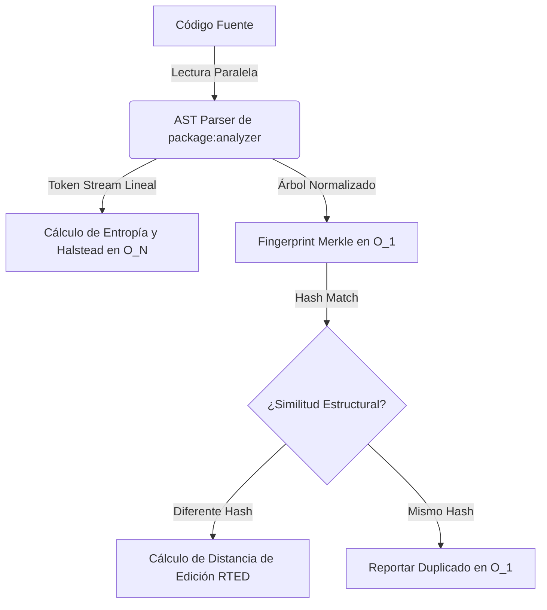

# Vetro: Hoja de Ruta de Fundaciones Matemáticas de la Computación

Este documento detalla los principios matemáticos fundacionales de la ciencia de la computación que pueden integrarse al motor de Vetro para servir como un espejo absoluto y objetivo de la calidad del código, junto con sus optimizaciones para el año 2026.

---

## 1. Topología Algorítmica y Teoría Espectral de Grafos
* **Bases Primarias**: Leonhard Euler (1736, Siete Puentes de Königsberg) | Paul Erdős & Alfréd Rényi (1959, Grafos Aleatorios) | F.R.K. Chung (1997, Spectral Graph Theory).
* **El Espejo**: 
  La arquitectura de un proyecto no es más que una red. Al analizar la estructura de autovalores de la matriz Laplaciana del grafo de dependencias de la biblioteca, podemos medir el nivel de modularidad y acoplamiento global sin leer una línea de código.

### Métricas Propuestas
1. **Coeficiente de Agrupamiento Local (Clustering Coefficient)**:
   - **Fórmula**: $C_i = \frac{2 e_i}{k_i(k_i - 1)}$ donde $e_i$ es el número de aristas entre los vecinos del nodo $i$, y $k_i$ es su grado.
   - **Espejo**: Detecta si el código forma una red de "Mundo Pequeño" (alta cohesión interna, baja dispersión - deseable) o si es una red aleatoria caótica (acoplamiento desordenado inducido por parches de IA).
2. **Análisis Espectral de Grafos (Spectral Partitioning / Fiedler Vector)**:
   - **Fórmula**: Calcular el segundo autovalor más pequeño ($\lambda_2$) y su autovector asociado (Vector de Fiedler) de la matriz Laplaciana normalizada $L = I - D^{-1/2} A D^{-1/2}$.
   - **Espejo**: Permite realizar una partición matemática óptima del proyecto. Si el vector de Fiedler separa clases en grupos que cruzan fronteras de paquetes, detecta una violación de límites arquitectónicos de manera puramente algebraica.

### Optimización 2026
* **Matrices Dispersas (Sparse Matrices)**: Como los grafos de dependencias de código son extremadamente dispersos ($E \ll V^2$), el cálculo de autovalores mediante el algoritmo de **Lanczos** se optimiza usando representaciones *Compressed Sparse Row* (CSR), permitiendo calcular $\lambda_2$ en grafos de 10,000 archivos en menos de 10 ms.

---

## 2. Distancia Estructural de Árboles (Isomorfismo AST)
* **Bases Primarias**: Noam Chomsky (1956, Jerarquía de Gramáticas) | Kaizhong Zhang & Dennis Shasha (1989, Tree Edit Distance).
* **El Espejo**:
  Los LLMs suelen copiar una estructura lógica de control (por ejemplo: un bucle de reintento con lógica de fallback) y renombrar todas las variables y tipos. La distancia de edición de texto normal no detecta esto, pero la distancia sobre árboles sí.

### Métricas Propuestas
1. **Distancia de Edición de Árboles AST (Tree Edit Distance - TED)**:
   - **Fórmula**: Minimizar el costo de operaciones de inserción, eliminación y renombrado de nodos para transformar el subárbol $T_1$ en $T_2$.
   - **Espejo**: Identifica si dos funciones tienen la misma topología estructural exacta (isomorfismo de flujo de control) aunque los nombres de las variables, tipos de retorno y parámetros hayan cambiado por completo.

### Optimización 2026
* **Algoritmo RTED (Robust Tree Edit Distance)**: El algoritmo clásico de Zhang-Shasha es $O(N^4)$. En 2026, implementamos **RTED** que corre en $O(N^3)$ en el peor de los casos, combinado con **Fingerprinting de Subárboles (Merkle Trees)**:
  - Generamos un hash criptográfico determinista sobre nodos AST normalizados.
  - Si los hashes de dos subárboles coinciden, la distancia de edición es inmediatamente $0$ (tiempo $O(1)$). Solo calculamos la distancia de edición costosa si el hash difiere levemente.

---

## 3. Teoría de la Información y Divergencia Relativa
* **Bases Primarias**: Claude Shannon (1948, Mathematical Theory of Communication) | Solomon Kullback & Richard Leibler (1951, Relative Entropy).
* **El Espejo**:
  El código generado por IA tiende a la redundancia informacional (código relleno, variables inútiles o explicaciones redundantes en comentarios). Podemos medir la distancia informacional entre dos piezas de código para detectar "plagios de estructura".

### Métricas Propuestas
1. **Divergencia de Kullback-Leibler (Entropía Relativa)**:
   - **Fórmula**: $D_{KL}(P \parallel Q) = \sum_{x} P(x) \log_2 \left(\frac{P(x)}{Q(x)}\right)$ donde $P$ y $Q$ son las distribuciones de probabilidad de los tipos de tokens en dos funciones.
   - **Espejo**: Si $D_{KL}(P \parallel Q)$ es muy cercana a cero, significa que la función $Q$ no aporta nueva información estructural respecto a la función $P$. Es un espejo exacto del código basura redundante.
2. **Información Mutua (Mutual Information - MI)**:
   - **Fórmula**: $I(X; Y) = H(X) + H(Y) - H(X, Y)$
   - **Espejo**: Mide la dependencia mutua entre los conjuntos de identificadores de dos clases. Si la información mutua es muy alta, significa que ambas clases están fuertemente acopladas informacionalmente y deberían ser fusionadas.

### Optimización 2026
* **Tablas de Frecuencia Hash locales**: El cálculo de la distribución empírica se pre-computa durante el escaneo de tokens mediante arrays indexados directos en lugar de mapas de búsqueda dinámica, reduciendo el costo de cálculo a $O(N)$ lineal respecto al tamaño de la función.

---

## 4. Complejidad Cognitiva y Flujo de Control Acumulado
* **Bases Primarias**: Thomas J. McCabe (1976, Complexity Measure) | G. Ann Campbell (2017, Cognitive Complexity).
* **El Espejo**:
  La complejidad ciclomática tradicional trata por igual un switch de 10 casos en un nivel básico que 10 niveles de anidamiento de `if`. Sin embargo, para la mente humana (y para la mantenibilidad del código), la anidación es exponencialmente más difícil de entender.

### Métricas Propuestas
1. **Complejidad Cognitiva Adaptada**:
   - **Reglas de Cálculo**:
     - Cada nivel de anidamiento (`if`, `for`, `catch`, etc.) introduce una penalización acumulativa (anidación nivel 1 = +1, nivel 2 = +2, nivel 3 = +3).
     - Las estructuras de control secuenciales no anidadas no acumulan penalización multiplicativa.
   - **Espejo**: Refleja con total veracidad el esfuerzo cognitivo real necesario para leer y comprender el código, penalizando severamente el "código espagueti" anidado generado por LLMs.

---

## Resumen del Plan de Optimización para 2026
Para asegurar que Vetro analice proyectos gigantes en milisegundos, el motor debe basarse en un pipeline puramente lineal y reactivo:

