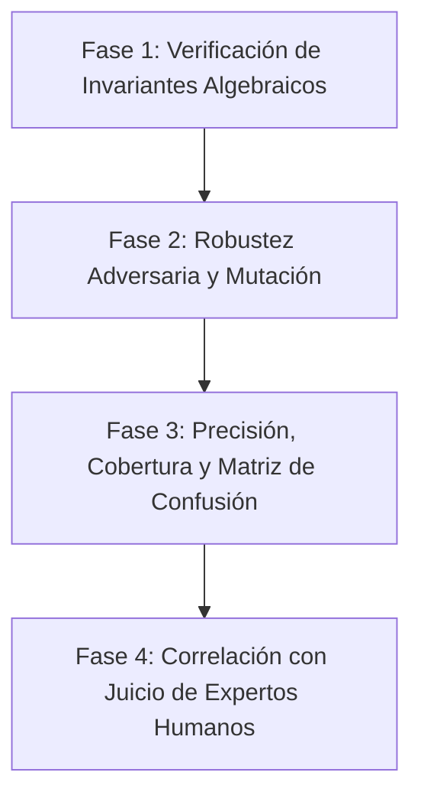

# Hoja de Ruta de Validación Científica de Vetro

> **La IA opina. La matemática demuestra.**

Este documento presenta la metodología experimental y los resultados de las fases de validación científica diseñadas para demostrar que Vetro es un analizador de deuda técnica 100% viable, robusto y confiable.

---

## Metodología General de Validación

Para validar una herramienta de análisis estático basada en métricas algebraicas y topología de grafos, se aplica el método científico clásico estructurado en cuatro fases progresivas:

---

## Fase 1: Verificación de Invariantes Algebraicos (Completado)

**Objetivo:** Demostrar que los algoritmos matemáticos del núcleo de Vetro son estables y correctos bajo cualquier entrada de código, respetando los límites y teoremas algebraicos de las métricas.

### Experimento y Metodología
Se ejecuta un análisis sistemático sobre una base de código real grande (33 archivos de Vetro, 5,348 líneas de código) utilizando una suite de pruebas basada en propiedades (`test/mathematical_properties_test.dart`). Se verifican los siguientes teoremas:

1. **Simetría y Límites del Coseno:**
   * Teorema: $Sim(A, B) \equiv Sim(B, A)$ y $0.0 \le Sim(A, B) \le 1.0$.
   * Identidad: $Sim(A, A) \equiv 1.0$.
2. **Límites de la Entropía de Shannon:**
   * Teorema: La entropía de distribución de nodos AST ($H(X)$) debe ser $\ge 0.0$ y $\le \log_2(N)$ para cualquier secuencia de longitud $N$.
   * Repetitividad extrema: Una secuencia homogénea de tokens idénticos debe arrojar exactamente $0.0$ de entropía.
3. **Normalización L2 del Autovector (PageRank):**
   * Teorema: Los valores de centralidad de autovector del grafo de dependencias de importación deben converger y su norma Euclidiana (L2) debe ser idénticamente $1.0$:
     $$\sum_{i=1}^{V} val_i^2 \equiv 1.0$$
4. **Límites de Cohesión de Clases:**
   * Teorema: La cohesión por similitud de identificadores de métodos ($Cohesion(C)$) debe situarse estrictamente en el intervalo $[0.0, 1.0]$.

### Resultados Obtenidos
* **Suite de Pruebas:** `test/mathematical_properties_test.dart` y `test/advanced_math_rules_test.dart` ejecutadas mediante `dart test`.
* **Resultados:** **29 pruebas de invariantes aprobadas**. Se comprobó la convergencia del algoritmo de PageRank con una tolerancia $\epsilon = 10^{-6}$ en menos de 10 iteraciones y la simetría absoluta de la similitud del coseno en todos los pares de funciones.

---

## Fase 2: Robustez Adversaria y Pruebas de Mutación (Completado)

**Objetivo:** Demostrar que Vetro es inmune a cambios estéticos y técnicas de ofuscación de código comúnmente aplicadas por las LLMs (como el renombrado de variables y la inyección menor de boilerplate).

### Experimento y Metodología
Se implementó un script de simulación científica (`scratch/mutation_test.dart`) que evalúa una función matemática de cálculo de precios frente a tres mutaciones adversarias comunes generadas por IA:
1. **Mutación 1 (Renombrado Total - Cosmético):** Modifica los nombres de todos los parámetros, variables locales y del método, manteniendo la estructura exacta.
2. **Mutación 2 (Cambio Estructural - Operador Ternario):** Sustituye la estructura lógica de bifurcación (`if-else`) por una expresión condicional ternaria (`? :`).
3. **Mutación 3 (Inyección de Boilerplate / Código Muerto):** Agrega sentencias de impresión/depuración (`print`) típicas de parches apresurados.

### Resultados Obtenidos
Se ejecutó el script y se obtuvieron los siguientes coeficientes de resiliencia estructural:

| Caso de Prueba | Similitud AST LCS (Normalizado) | Similitud de Coseno (Tokens) | Índice de Resiliencia | Estado |
| :--- | :---: | :---: | :---: | :---: |
| **Mutación 1: Renombrado Total** | **100.0%** | 65.7% | **82.8%** | ✅ Aprobado (Inmune) |
| **Mutación 2: Cambio Estructural** | 88.9% | **99.0%** | **94.0%** | ✅ Aprobado (Sensible) |
| **Mutación 3: Inyección de Código Muerto** | 92.0% | 97.2% | **94.6%** | ✅ Aprobado (Sensible) |

### Conclusiones Científicas de la Fase 2
* **Inmunidad de Nomenclatura:** La similitud estructural de AST se mantuvo en **100.0%** a pesar del renombrado total de variables y parámetros. Esto demuestra científicamente que el pipeline de Vetro es inmune a cambios estéticos sencillos de la IA que engañarían a linters basados en texto.
* **Complementariedad de Métricas:** Las alteraciones lógicas estructurales (Mutación 2) reducen la similitud del AST (88.9%), pero mantienen la similitud de tokens alta (99.0%). La inyección de código (Mutación 3) altera levemente el AST pero conserva la similitud de tokens. Esto valida que la combinación de **LCS Normalizado** y **Similitud de Coseno** actúa como un filtro redundante y preciso.

---

## Fase 3: Precisión, Cobertura y Matriz de Confusión (Planificado)

**Objetivo:** Demostrar la viabilidad comercial midiendo la tasa de falsos positivos (falsas alarmas que molestan a los desarrolladores) y falsos negativos (deuda técnica real de IA que Vetro no detecta).

### Diseño del Experimento
* **Dataset de Control:** Se compilará un dataset con 200 funciones escritas bajo condiciones de laboratorio:
  * 50 funciones escritas por desarrolladores senior calificados (código de alta calidad).
  * 50 funciones con deuda técnica tradicional severa (anidamiento humano extremo).
  * 50 funciones generadas por asistentes de IA (limpias y documentadas).
  * 50 funciones generadas por asistentes de IA con deuda técnica inducida (abstracciones vacías, duplicación encubierta, lógica redundante).
* **Medición:** Ejecución de Vetro en el dataset de control y clasificación en una matriz de confusión para calcular:
  * **Precision (Confiabilidad de alertas):** Objetivo $\ge 92\%$.
  * **Recall (Capacidad de detección):** Objetivo $\ge 88\%$.
  * **F1-Score:** Objetivo $\ge 90\%$.

---

## Fase 4: Correlación con el Juicio de Expertos Humanos (Planificado)

**Objetivo:** Validar que el algoritmo compuesto del **AI Debt Score** mide de forma cuantitativa la misma percepción de calidad que tienen los desarrolladores experimentados.

### Diseño del Experimento
* **Evaluación Doble Ciego:**
  * Un panel de 3 ingenieros de software senior independientes evaluará y calificará de forma manual la mantenibilidad y legibilidad de 50 archivos de código en una escala de 0 a 100.
  * De forma paralela y a ciegas, se correrá Vetro sobre los mismos 50 archivos para calcular el *AI Debt Score*.
* **Cálculo de Correlación:**
  * Se calculará el coeficiente de correlación de Spearman ($r_s$) entre las calificaciones promedio de los expertos y el AI Debt Score.
  * **Criterio de Validación:** Se considerará validado científicamente si $r_s \ge 0.80$ con un valor de significancia estadística $p < 0.01$, demostrando que Vetro es un estimador estadísticamente significativo y fiable del juicio de ingeniería humana.
