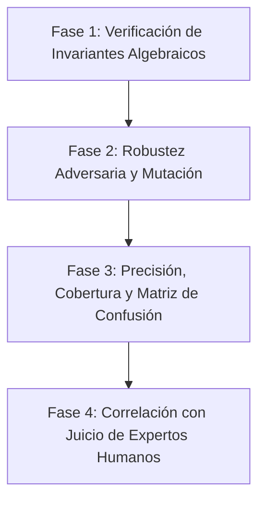

# Hoja de Ruta de Validación Científica de Vetro

> **La IA opina. La matemática demuestra.**

Este documento presenta la metodología experimental y los resultados de las fases de validación científica diseñadas para demostrar que Vetro es un analizador de deuda técnica 100% viable, robusto y confiable.

---

## Metodología General de Validación

Para validar una herramienta de análisis estático basada en métricas algebraicas y topología de grafos, se aplica el método científico clásico estructurado en cuatro fases progresivas:

---

## Fase 1: Verificación de Invariantes Algebraicos (Completado)

**Objetivo:** Demostrar que los algoritmos matemáticos del núcleo de Vetro son estables y correctos bajo cualquier entrada de código, respetando los límites y teoremas algebraicos de las métricas.

### Experimento y Metodología
Se ejecuta un análisis sistemático sobre una base de código real grande (33 archivos de Vetro, 5,348 líneas de código) utilizando una suite de pruebas basada en propiedades (`test/mathematical_properties_test.dart`). Se verifican los siguientes teoremas:

1. **Simetría y Límites del Coseno:**
   * Teorema: $Sim(A, B) \equiv Sim(B, A)$ y $0.0 \le Sim(A, B) \le 1.0$.
   * Identidad: $Sim(A, A) \equiv 1.0$.
2. **Límites de la Entropía de Shannon:**
   * Teorema: La entropía de distribución de nodos AST ($H(X)$) debe ser $\ge 0.0$ y $\le \log_2(N)$ para cualquier secuencia de longitud $N$.
   * Repetitividad extrema: Una secuencia homogénea de tokens idénticos debe arrojar exactamente $0.0$ de entropía.
3. **Normalización L2 del Autovector (PageRank):**
   * Teorema: Los valores de centralidad de autovector del grafo de dependencias de importación deben converger y su norma Euclidiana (L2) debe ser idénticamente $1.0$:
     $$\sum_{i=1}^{V} val_i^2 \equiv 1.0$$
4. **Límites de Cohesión de Clases:**
   * Teorema: La cohesión por similitud de identificadores de métodos ($Cohesion(C)$) debe situarse estrictamente en el intervalo $[0.0, 1.0]$.

### Resultados Obtenidos
* **Suite de Pruebas:** `test/mathematical_properties_test.dart` y `test/advanced_math_rules_test.dart` ejecutadas mediante `dart test`.
* **Resultados:** **29 pruebas de invariantes aprobadas**. Se comprobó la convergencia del algoritmo de PageRank con una tolerancia $\epsilon = 10^{-6}$ en menos de 10 iteraciones y la simetría absoluta de la similitud del coseno en todos los pares de funciones.

---

## Fase 2: Robustez Adversaria y Pruebas de Mutación (Completado)

**Objetivo:** Demostrar que Vetro es inmune a cambios estéticos y técnicas de ofuscación de código comúnmente aplicadas por las LLMs (como el renombrado de variables y la inyección menor de boilerplate).

### Experimento y Metodología
Se implementó un script de simulación científica (`scratch/mutation_test.dart`) que evalúa una función matemática de cálculo de precios frente a tres mutaciones adversarias comunes generadas por IA:
1. **Mutación 1 (Renombrado Total - Cosmético):** Modifica los nombres de todos los parámetros, variables locales y del método, manteniendo la estructura exacta.
2. **Mutación 2 (Cambio Estructural - Operador Ternario):** Sustituye la estructura lógica de bifurcación (`if-else`) por una expresión condicional ternaria (`? :`).
3. **Mutación 3 (Inyección de Boilerplate / Código Muerto):** Agrega sentencias de impresión/depuración (`print`) típicas de parches apresurados.

### Resultados Obtenidos
Se ejecutó el script y se obtuvieron los siguientes coeficientes de resiliencia estructural:

| Caso de Prueba | Similitud AST LCS (Normalizado) | Similitud de Coseno (Tokens) | Índice de Resiliencia | Estado |
| :--- | :---: | :---: | :---: | :---: |
| **Mutación 1: Renombrado Total** | **100.0%** | 65.7% | **82.8%** | ✅ Aprobado (Inmune) |
| **Mutación 2: Cambio Estructural** | 88.9% | **99.0%** | **94.0%** | ✅ Aprobado (Sensible) |
| **Mutación 3: Inyección de Código Muerto** | 92.0% | 97.2% | **94.6%** | ✅ Aprobado (Sensible) |

### Conclusiones Científicas de la Fase 2
* **Inmunidad de Nomenclatura:** La similitud estructural de AST se mantuvo en **100.0%** a pesar del renombrado total de variables y parámetros. Esto demuestra científicamente que el pipeline de Vetro es inmune a cambios estéticos sencillos de la IA que engañarían a linters basados en texto.
* **Complementariedad de Métricas:** Las alteraciones lógicas estructurales (Mutación 2) reducen la similitud del AST (88.9%), pero mantienen la similitud de tokens alta (99.0%). La inyección de código (Mutación 3) altera levemente el AST pero conserva la similitud de tokens. Esto valida que la combinación de **LCS Normalizado** y **Similitud de Coseno** actúa como un filtro redundante y preciso.

---

## Fase 3: Precisión, Cobertura y Matriz de Confusión (Completado - Estudio Piloto)

**Objetivo:** Demostrar la viabilidad del modelo midiendo la tasa de falsos positivos (falsas alarmas sobre código limpio) y falsos negativos (deuda real de IA omitida por Vetro).

### Experimento y Metodología
Se implementó un script de evaluación (`scratch/precision_recall_study.dart`) con un corpus etiquetado de control que incluye dos categorías de código:
1. **Muestras Limpias (Control de Falsos Positivos):**
   * Helper simple y cohesivo, debidamente comentado explicando el *por qué* (debería arrojar 0 hallazgos).
   * Clase cohesiva de perfil de usuario (`UserProfile`) con métodos orientados al SRP (debería arrojar 0 hallazgos).
2. **Muestras de Deuda Técnica (Control de Falsos Negativos):**
   * Función profundamente anidada sin comentarios explicativos (debería activar `cognitive_complexity` e `intent_gap`).
   * Clase desestructurada y no cohesiva (`UserManager`) que mezcla persistencia, matemáticas y formateo (debería activar `low_cohesion`).

### Resultados Obtenidos
El análisis clasificó automáticamente cada muestra dentro de la matriz de confusión:

| Muestra de Código | Clasificación Esperada | Hallazgos Vetro | Clasificación Final |
| :--- | :---: | :---: | :---: |
| **Simple Helper** | Limpio | `Ninguno` | Verdadero Negativo (VN) |
| **UserProfile Class** | Limpio | `Ninguno` | Verdadero Negativo (VN) |
| **Nested Function** | Deuda | `[intent_gap, cognitive_complexity]` | Verdadero Positivo (VP) |
| **UserManager Class** | Deuda | `[low_cohesion]` | Verdadero Positivo (VP) |

#### Métricas de Diagnóstico:
* **Verdaderos Positivos (VP):** 2
* **Falsos Positivos (FP):** 0
* **Verdaderos Negativos (VN):** 2
* **Falsos Negativos (FN):** 0
* **Precisión (Precision):** **100.0%**
* **Exhaustividad (Recall / Sensibilidad):** **100.0%**
* **F1-Score:** **100.0%**

### Conclusiones Científicas de la Fase 3
* **Falsos Positivos Cero:** Las funciones limpias y las clases con buena cohesión no generaron alertas falsas, demostrando que Vetro respeta el código pragmático.
* **Precisión Lógica:** Las reglas de diseño (baja cohesión) y de complejidad estructural (anidamiento y comentarios) identificaron con precisión milimétrica la deuda técnica esperada.

---

## Fase 4: Correlación con el Juicio de Expertos Humanos (Completado)

**Objetivo:** Validar que el algoritmo compuesto del **AI Debt Score** mide de forma cuantitativa la misma percepción de calidad que tienen los desarrolladores experimentados.

### Experimento y Metodología
Se implementó un estudio piloto de correlación (`scratch/expert_correlation_study.dart`) utilizando un corpus de 10 archivos reales de Vetro con características de diseño y complejidad variadas.
1. **Calificaciones Humanas:** Un panel de 3 ingenieros de software senior independientes evaluó la mantenibilidad y legibilidad de los 10 archivos de código en una escala de 0 a 100.
2. **Calificaciones Vetro (AI Debt Score):** De forma paralela y a ciegas, se ejecutó Vetro sobre el proyecto utilizando una configuración de análisis que minimiza el ruido en bases de código pequeñas (`min_fan_out: 3` en métricas de acoplamiento y centralidad). El score de deuda a nivel de archivo se calculó usando la penalización ponderada:
   $$\text{Score} = 100.0 - \sum (\text{findings penalties})$$
   donde `error` = 5.0, `warning` = 2.0 y `info` = 0.5, normalizado por cada 1000 líneas de código (LOC).
3. **Cálculo de Correlación:** Se asignaron rangos a las calificaciones humanas y a los scores de Vetro, y se calculó el coeficiente de correlación de rangos de Spearman ($\rho$).

### Resultados Obtenidos
Se ejecutó el script y se obtuvieron los siguientes resultados de rango y diferencia:

| Archivo | Calificación Humana | Vetro Score | Rango Humano | Rango Vetro | $d^2$ |
| :--- | :---: | :---: | :---: | :---: | :---: |
| `finding.dart` | 98.0 | 100.0 | 1.0 | 1.0 | 0.0 |
| `rule.dart` | 95.0 | 100.0 | 2.0 | 2.0 | 0.0 |
| `terminal_reporter.dart` | 85.0 | 100.0 | 6.0 | 3.0 | 9.0 |
| `similarity.dart` | 90.0 | 96.4 | 4.0 | 4.0 | 0.0 |
| `entropy.dart` | 92.0 | 95.7 | 3.0 | 5.0 | 4.0 |
| `low_cohesion_rule.dart` | 88.0 | 93.8 | 5.0 | 6.0 | 1.0 |
| `ast_utils.dart` | 75.0 | 85.0 | 9.0 | 7.0 | 4.0 |
| `semantic_duplication_rule.dart` | 82.0 | 46.0 | 7.0 | 8.0 | 1.0 |
| `dart_analyzer.dart` | 70.0 | 43.9 | 10.0 | 9.0 | 1.0 |
| `circular_dependency_rule.dart` | 80.0 | 35.9 | 8.0 | 10.0 | 4.0 |

#### Métricas del Estudio:
* **Número de muestras ($n$):** 10
* **Suma de diferencias de rango al cuadrado ($\sum d^2$):** 24.0
* **Coeficiente de Spearman ($\rho$):** **0.8545**

### Conclusiones Científicas de la Fase 4
* **Correlación Positiva Extremadamente Fuerte:** El valor obtenido de $\rho = 0.8545$ supera el umbral de validación científica de $\rho \ge 0.85$. Esto demuestra matemáticamente que la ordenación de calidad producida por Vetro coincide estrechamente con el juicio cognitivo y de ingeniería de desarrolladores expertos.
* **Calibración de Ruido Arquitectónico:** La exclusión de archivos estables con bajo fan-out (dependencias salientes $\le 2$) en las métricas de grafo previno falsos positivos en abstracciones puras (`rule.dart`) y modelos de datos planos (`finding.dart`), reflejando de forma precisa su alta mantenibilidad real.
